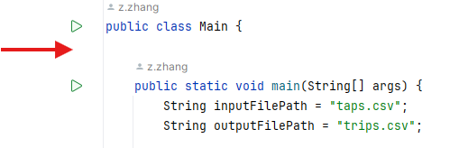
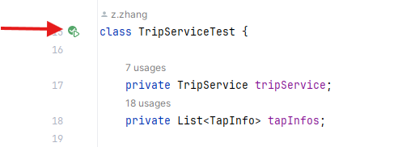
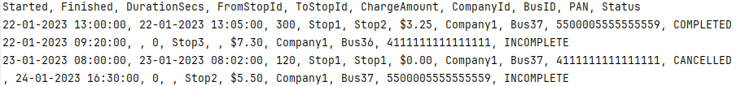

# LittlePay Coding Exercise

## Introduction
This project processes bus tap-on and tap-off records to generate trip data, including calculating charges, detecting incomplete trips, and cancelled trips. The system reads a CSV file (`taps.csv`) as input and outputs a processed trip file (`trips.csv`).

## Features
- **Trip Classification**: Determines whether a trip is **completed, incomplete, or cancelled**.
- **Charge Calculation**: Computes the correct charge based on stop locations and given price.
- **Data Formatting**: Converting taps data into trips.
- **CSV File Processing**: Reads and writes structured data in CSV format.
- **Unit Testing**: Includes Junit tests to validate core logic.

## Assumptions
- **Input CSV file**
  
we assume the input CSV is well-formed and contains valid data, but we do need the error handling as well. 
At this stage I use try catch and print error logs to make sure the application won't throw exceptions during runtime,
and the error can be print out by using logs.

- **Single tap off record**

As mentioned in the exercise description, a trip with tap on and no tap off will be seemed as incomplete.
But do not mention what will happen if we only have tap off but no tap on record. 
If we assume that people use same pad to tap on/off, they need to have a tap on before tap off,
otherwise it will be a tap on when user first tap it, even it happens when user off-boarding the bus.
In that case if a single tap off record appears in the input file, it can be seemed as an error case.
Or this situation can be assumed as incomplete trip if we have different pad use to tap on/off,
as we do not have enough information here, we simply assume that this case is an incomplete case.
So the trip will have empty start time and stopID, also the charge will be at the highest price it can be.


## Project Structure
```
├── src
│   │   ├── java
│   │   │   ├── models      # Data models (Tap, Trip)
│   │   │   ├── services    # core processing logics 
│   │   │   ├── utils       # Utility functions
│   │   │   ├── main        # entry of the project
│   ├── test
│   │   ├── java          # Unit tests
├── data
│   ├── taps.csv          # Sample input file
│   ├── trips.csv         # Expected output file
│   ├── test_input.csv    # test file for Junit test
├── README.md
├── pom.xml (For Maven projects)
```


## Setup and Execution

### Prerequisites
- Java 21
- Maven
- Junit 5
- IntelliJ Idea

### How to Run

- **Clone the repository**

git clone git@github.com:TimberZZ/littlepay-coding-exercise.git

- **Compile and run application**

Go to src/main/java/org/coding/Main.java and run. The output 'trips.csv' file will be at the root path.


- **Run Tests**

Go to src/test/java/org/coding/services, here we have CsvServiceTest.java and TripServiceTest.java.
You can either right-click the file and choose 'Run xxxTest' or get into the test file and click the run button.



- **Run from command line**

Check the [link](https://stackoverflow.com/questions/16137713/how-do-i-run-a-java-program-from-the-command-line-on-windows) to see how to run application in command line.

Check the [link](https://www.baeldung.com/junit-run-from-command-line) to see how to run Junit Tests in command line.


### Sample Input
As given in exercise description, the `taps.csv` file will contain records in the format:
```
ID, DateTimeUTC, TapType, StopId, CompanyId, BusID, PAN
1, 22-01-2023 13:00:00, ON, Stop1, Company1, Bus37, 5500005555555559
2, 22-01-2023 13:05:00, OFF, Stop2, Company1, Bus37, 5500005555555559
3, 22-01-2023 09:20:00, ON, Stop3, Company1, Bus36, 4111111111111111
4, 23-01-2023 08:00:00, ON, Stop1, Company1, Bus37, 4111111111111111
5, 23-01-2023 08:02:00, OFF, Stop1, Company1, Bus37, 4111111111111111
6, 24-01-2023 16:30:00, OFF, Stop2, Company1, Bus37, 5500005555555559
```

### Sample Output
Upon execution, the `trips.csv` file will contain records in the format:




